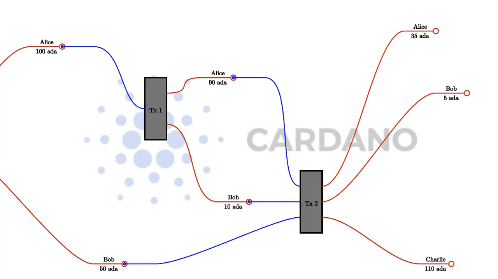

# Week 1 notes

[Lecture](https://www.youtube.com/watch?v=IEn6jUo-0vU)

## The (E)UTxO Model

Stands for Extended Unspent Transaction Output Model.
UTxO Model is what Bitcoin uses. Ethereum uses the Account Based model which is like a normal bank.

### UTxO Model

To make a UTxO transaction of 10 ADA from a 100 ADA wallet, you can't split the wallet into 10 ADA and 90 ADA, the whole value of the wallet must be used as an input. If Alice is sending 10 ADA to Bob, two transactions would be created, 1 to send 10 ADA to Bob and 90 ADA being sent back to Alice. Therefore the sum of the input value must equal the sum of output value (excluding fees) unless the transaction is minting new tokens or burning existing tokens. The tranaction must be signed by the user. More complex transactions can be created which require multiple UTxO inputs as demonstrated in the image below.

### (E)UTxO Model

The extended model allows arbitrary logic to replace the signing of a transaction. This allows for the writing of smart contracts. Instead of just having an address represented by a public key which is verified by a signature that is added to the transaction, instead there are more general addresses (that are not based on public keys) which represent arbitrary logic. The digital signature is replaced by a _"redeemer"_.

UTxO Script-Redeemer Example")

Bitcoin smart contracts (called Bitcoin Script) are only able to see the current transaction they are dealing with as opposed to Ethereum smart contracts which are able to see the entire blockchain. The Ethereum approach comes with some problems. Because the scripts are so powerful it is very difficult to predict what they will do which opens the door to security issues.

Cardano does something in the middle of these two. It cannot see the entire blockchain but it can see an entire transaction (as opposed to Bitcoin which can only see one script-redeemer pair at a time). In addition to an ADA value being supplied for a transaction, a piece of data can also be attached which is referred to as _"datum"_. It is mathematically proveable that this approach is as powerful as the Ethereum model but also offers some advantages. In Plutus, it is possible to verify that a transaction will be successful before the ADA ever leaves your wallet. It is possible that things can still go wrong, like someone else has already consumed your transaction before you are able to send it, but in this case you will just get the value of your transaction back without having to pay any fees. In Ethereum, it's possible for a transaction to fail and you still need to pay gas fees.

[Plutus Playground Set Up Instructions](https://youtu.be/IEn6jUo-0vU?t=1639)
