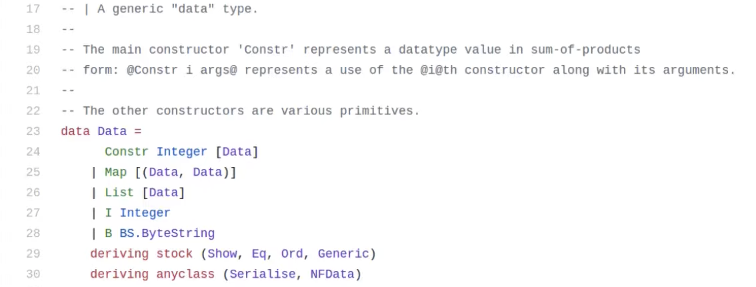

# Week 2 notes

[Lecture](https://www.youtube.com/watch?v=E5KRk5y9KjQ)

There are two parts to a smart contract. An _On-chain part_ and an _Off-chain part_. The On-Chain part is about validation, it allows nodes to validate a given transaction and determine if it's allowed to consume a given UTxO. The Off-Chain part lives in the users wallet and submits suitable transactions.

There are three pieces of data that a Plutus Scrupt receives

- the Datum
- the Redeemer
- the Context

These three pieces of data need to be represented in Haskell by some concrete data type. At a low level, the same data type is used for all three of these pieces of data but there are higher level types available which are more useful for real world scenarios. This low level data type can be found in code [here](https://github.com/input-output-hk/plutus/blob/master/plutus-tx/src/PlutusTx/Data.hs)



This is very similar to the JSON data type.

In order to play with this data type in the repl:
Run `cabal repl` in this weeks code folder then

```
  import PlutusTx
  :i Data

  -- call the contructor with 7 as the data
  I 7

  -- check the type of the data. Returns "I 7 :: Data"
  :t I 7

  -- user overloaded strings to create byte strings
  :set -XOverloadedStrings
  :t B "Haskell"
  -- returns B "Haskell" :: Data

  Map [ (I 7, B "Haskell"), (List [I 0], I 1000) ]
  :t Map
  -- returns Map :: [(Data, Data)] -> Data
```

## Validators

A validator is a script that take three pieces of input (Datum, Redeemer and Context) and at the lowest level these are all of type `Data`.

```
-- () in Haskell means Unit which is similar to void
mkValidator :: Data -> Data -> Data -> ()
-- the only value of the Unit type is ()
```

Returning Unit `()` is unusual in Haskell because side effects are generally not allowed unless you're interacting with IO or something like that. In this validator function, Unit is used to signify that the validation has succeeded. If the function throws an exception, validation was unsuccessful and the transaction will fail.

```
{-# INLINABLE mkValidator #-}
mkValidator :: Data -> Data -> Data -> ()
mkValidator _ _ _ = ()
-- this is the simplest validator you can write. _ means we don't care about the argument that gets passed.

validator :: Validator
validator = mkValidatorScript $$(PlutusTx.compile [|| mkValidator ||])
```

The last command in the code block above turns the mkValidator above into a Plutus validator using template Haskell. Template Haskell allows functions to be executed at compile time instead of runtime. The output of this function creates code which is then inserted in the Haskell script.

`$$` means splice and `||` are Oxford brackets. When making more complicated validator functions it is normal to have helper functions associated with it which will need place inside the Oxford brackets in order for the code for the validator to be generated at compile time.

`{-# INLINABLE mkValidator #-}` aka Inlinable pragma means the code of this function can be inlined inside the Oxford brackets

```
valHash :: Ledger.ValidatorHash
valHash = Scripts.validatorHash validator

scrAddress :: Ledger.Address
scrAddress = ScriptAddress valHash
```

This block of code produces a Plutus script address. All the above code is boilerplate and will be the same for nearly all contracts written for Plutus with the exception of the validator function (`mkValidator`) definition.

In addition to the On Chain validator logic some Off Chain wallet logic will need to be written which is out of scope for this lesson.

In order to make a validator fail a Plutus error needs to be return. Unlike the `error` function in Haskell (which takes a string) the Plutus error function just takes Unit `()` as its single argument

```
  -- returning an error from our validator
  mkValidator _ _ _ = error ()
```

Given this has no message, it is not very helpful so Plutus provides another way to return and error with a message via the `traceError` function. This takes a _Plutus String_ as opposed to a normal Haskell string. String literals can still be used to represent _Plutus Strings_ in code. In order to use string literals as _Plutus Strings_ you need to have the overloaded strings extension in scope (`{-# LANGUAGE OverloadedStrings #-}`)

A real validator type definition would look something like this

```
-- Datum -> Redeemer -> Validator Context -> was Validation successful?
mkValidator :: () -> Integer -> ValidatorCtx -> Bool
```

The typing of the Datum and the Redeemer are dependant upon whatever makes the most sense for the business logic of the contract being written. Using the code in the `FortyTwo.hs` example and making it slightly more "real" (based on the type definition above) would lead to a function body like

```
  mkValidator () r _
    | r == 42 = True
    | otherwise = False
```

In order to use this typed validator we would need to

```
import qualified Ledger.Typed.Scripts as Scripts
-- other code goes here
data Typed
instance Scripts.ScriptType Typed where
    type instance DatumType Typed = ()
    type instance RedeemerType Typed = Integer
```

to tell the compiler which types we used for the Datum and the Redeemer. In Haskell this is referred to "Type Level Programming".

```
inst :: Scripts.ScriptInstance Typed
inst = Scripts.validator @Typed
    $$(PlutusTx.compile [|| mkValidator ||])
    $$(PlutusTx.compile [|| wrap ||])
  where
    wrap = Scripts.wrapValidator @() @Integer
```

In order to make use of all the above we would now need to create the validator by

```
validator = Scripts.validatorScript inst
```

With all this, we have turned the untyped version of the FortyTwo validator from an "untyped" validator (`Data -> Data -> Data`) into a typed version (`() -> Integer -> ValidatorCtx`). A full example of the typed FortyTwo contract can be seen in the `Typed.hs` file.

Previously we were throwing an error to cause validation to fail. With the above typed example this is not happening so if validation fails we will be unsure why it has failed. Plutus has a helper that will allow us to display messages if the validator returns `False`

```
mkValidator :: () -> Integer -> ValidatorCtx -> Bool
mkValidator () r _ = traceIfFalse "wrong redeemer" $ r == 42
```

An example of how to use a custom data type for the redeemer can be found in the `IsData.hs` file.
