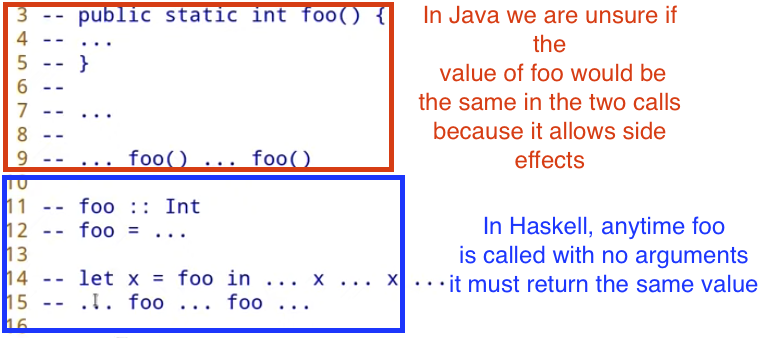

# Week 3 notes

[Lecture](https://www.youtube.com/watch?v=6Reuh0xZDjY)

This lecture focuses on the off chain part of transactions.

For the off chain part of transactions there is no need to compile to Plutus. Plain Haskell script can be used which makes things simpler in some ways (for example, there is no need for things like `{-# INLINABLE mkValidator #-}`). The disadvantage of using plain Haskell is that it more advanced features of Haskell need to be used like effect systems, streaming and monads. The wallet code is written in special monad called the contract monad. Monads are normally the first major stumbling block for people trying to learn Haskell.

## Crash Course in Monads



In the above image, for the Haskell example, we could replace all the calls to `foo` with the number it returns. This is known as [referential transparency](https://en.wikipedia.org/wiki/Referential_transparency). Due to not having side effects we can guarantee this value will always be the same. In Java, the same assumption can not be made. This makes Haskell code easier to test and reason about but for a program to be useful, there needs to be side effects like user input. Haskell deals with side effects using the IO monad.

```
foo :: IO Int
foo = ...
```

In the above `foo` example, `IO Int` is an action/recipe to compute an `Int` and this function can invoke side effects. Referential transparancy is maintained because `foo` is just a recipe to produce an `Int` but no execution happens at compile time. The only way to execute a recipe like this is to call it in the `main` function of a Haskell program or in the repl. Below is Haskell's "Hello, world" example.

```
main :: IO ()
main = putStrLn "Hello, world!"
```

The `IO` method has a monad instance but also has a functor instance. A functor is defined as

```
(a -> b) -> f a -> f b
```

meaning when provided with a function that turns `a` to `b` it will return a function that creates an `a` and a function that creates a `b`.

`>>` is an infix operator in Haskell that takes two functions, performs all the side effects of the first but discards the result and then performs the second keeping the result. In order to keep the result of the first function the bind (`>>=`) operator is needed.

```
-- type of bind operator
(>>=) :: Monad m => m a ->  (a -> m b) -> m b
```

This type definition means if I have a recipe that produces an `a` (`m a`) and a recipe that takes an `a` and returns a recipe that produces `b`, bind can create a function that returns a recipe to create a `b`. Using the bind operator with the IO monad we can create arbitrarily complex sequences like

```
bar :: IO ()
bar = getLine >>= \s ->
      getLine >>= \t ->
      putStrLn (s ++ t)
```

The `Maybe` type is one of the most helpful types in Haskell. It is also known as "optional" in other programming languages.

```
-- definition of Maybe
data Maybe a = Nothing | Just a

-- an example of reading an integer without using Maybe
read "42" :: Int
-- returns 42
read "42+ü" :: Int
-- returns an error

-- example with Maybe
readMaybe "42" :: Maybe Int
-- returns Just 42
readMaybe "42+ü" :: Maybe Int
-- returns Nothing
```

Lar's example

```
foo :: String -> String -> String -> Maybe Int
foo x y z = case readMaybe x of
  Nothing -> Nothing
  Just k -> case readMaybe y of
    Nothing -> Nothing
    Just l -> case readMaybe z of
      Nothing -> Nothing
      Just m -> Just (k + l + m)

```

Looking at this code, you will see we repeat the same pattern three times. This should be abstracted away by doing something like

```
bindMaybe :: Maybe a -> (a -> Maybe b) -> Maybe b
bindMaybe Nothing _ = Nothing
bindMaybe (Just x) f -> f x

-- foo from above rewritten to use bindMaybe
foo :: String -> String -> String -> Maybe Int
foo x y z = readMaybe x `bindMaybe` \k ->
            readMaybe y `bindMaybe` \l ->
            readMaybe z `bindMaybe` \m ->
            Just (k + l + m)
```

The above code can be seen in the `Maybe.hs` file.

A similar example to Maybe using the Either fucntion can be seen in `Either.hs`. A more complicated example of a similar thing can be seen in the `Writer.hs` file. In the `Writer.hs` example you can see the standard pattern for implementing a Monad

```
-- leftM and ap are a helpers available from Control.Monad library.
instance Functor Writer where
    fmap = liftM

instance Applicative Writer where
    pure = return
    (<*>) = ap

instance Monad Writer where
    return a = Writer a []
    (>>=) = bindWriter
```

The Functor and Applicative instances are generally the same for any Monad you will write. Usually it is only need to write the return and bind methods for a Monad instance (as seen above).

## Off Chain Code

In order to test contracts without firing up the whole playground environment you can use `EmualtorTrace`. A detailed explanation of how to do this can be found [here](https://youtu.be/6Reuh0xZDjY?t=5452) and an example can be found in the `Trace.hs` file.

The purpose of the `Contract` monad is to define off chain code that runs in the wallet. The `Contract` monad has 4 parameters, `w`, `s`, `e` and `a`.

- `a` denotes the return type of the contract
- `w` is like the Writer example from this week. It allows you to write log messages of type `w`
- `s` describes the blockchain capabilities (what blockchain actions can this contract perform) which normally includes waiting for slots, making transactions and finding out your own public key but can also contain specific endpoints.
- `e` describes the type of error messages

The `BlockchainActions` type includes all the functions for doing blockchain actions (obviously) such as waiting for a slot, waiting for `n` slots and so on. Text is a more efficient form of string in Haskell and is almost always used as the type for `e` in Contracts.

```
myContract1 :: Contract () BlockchainActions Text ()
-- the @String here is to tell the compiler that we want to use the String type and not text.
-- the confusion is cause by the {-# LANGUAGE OverloadedStrings #-} extension
-- {-# LANGUAGE TypeApplications #-} allows us to use @type to tell the compiler the correct type
myContract1 = Contract.logInfo @String "Hello from the Contract"
```

The full example can be seen in `Contract.hs`.

In order to extend the `s` parameter to inlcudes endpoints in addition to blockchain actions we need to

```
{-# LANGUAGE DataKinds     #-}
{-# LANGUAGE TypeOperators #-}

type MySchema = BlockchainActions .\/ Endpoint "foo" Int

myContract :: Contract () MySchema Text ()
myContract = do
    -- this will block actions until the foo endpoint is invoked
    n <- endpoint @"foo"
```

The `w` (Writer) must be an instance of the type Monoid. Monoids have two functions as part of their type definition, `mempty` and `mappend`. The prime example of these in Haskell is lists. `mempty` would be an empty list and `mappend` would be concatenation of lists.

```
mempty :: [Int]
[]

mappend :: [1, 2, 3 :: Int] [4, 5, 6]
[1, 2, 3, 4, 5, 6]
```

[Homework Explanation](https://youtu.be/6Reuh0xZDjY?t=7563)
